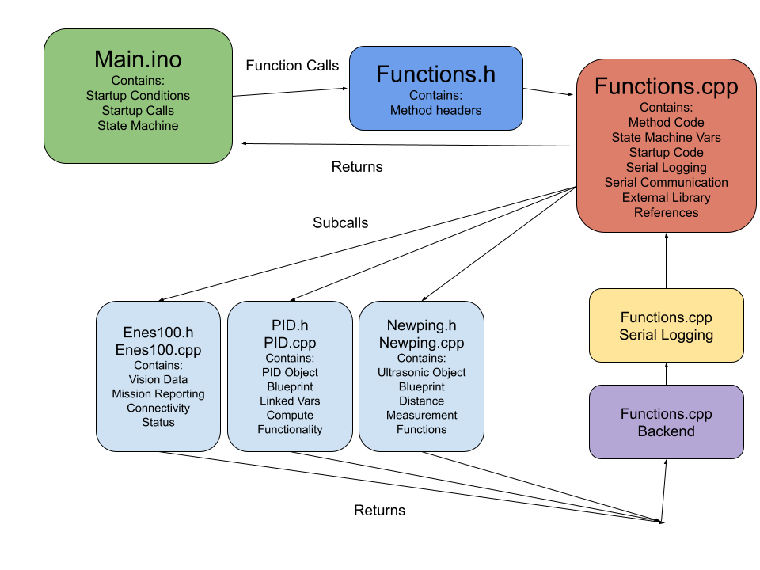

# R6
Code for ENES 100 Section 1101 Team 2

## Notes on Code Organization
1. All executive level functions should be called from the Main.ino file
2. All functions are declared by name in Functions.h
3. The actual code for the functions exist in Functions.cpp

## Functionality
1. boolean detectBField() -> Reads the magnetic field from the B-Field Sensor and reports it to the ENES 100 system. 
1. boolean driveToPoint(double x, double y, double theta) -> Drives the robot to the given coordinates using the turnToAngle() function.
1. boolean squareWaveRead() -> Reads the squarewave off of the contact pads on the outside of the claw and reports it to the ENES 100 system if it is a valid reading. Returns true if reading and reporting was sucessful, returns false if the reading failed. 

1. float ultrasonicDistance1() -> Returns the value in inches of the left ultrasonic sensor
1. float ultrasonicDistance2() -> Returns the value in inches of the right ultrasonic sensor
1. float unifiedUltrasonicClosest() -> Returns the lower of ultrasonicDistance1() and ultrasonicDistance2()

1. int getState() -> Returns the current state of the system state machine

1. void connectCheck() -> Polls the ENES 100 library and checks if the robot is connected, if it is not retry the begin statement.
1. void driveOverLog() -> Drives the robot forward until the x coordinate is over the log and into the destinatation zone.
1. void fullScore() -> Completes the full scoring sequence, calling squareWaveRead(), detectBField(), changing the servo position and moving the pinion via pinionDrive(int pwm)
1. void initiaizeProgram(bool connectToENES) -> Called on Arduino startup, connects the serial monitor, if connectToENES is true it will establish a connection to the ENES 100 service.
1. void incrementState() -> Increments the state machine variable by 1
1. void obstacleNavigate() -> Turns to angle 0, then drives forward briefly, next drives the bottom arena wall and turns to face the destination zone, then drives along the wall until getting to x = 2.55. Then calls the driveOverLog() function.
1. void pathfindToObjective() -> Determines starting position and then turns to face the opposite starting box, drives forward to a point right before the pylon, then drives forward slowly towards the objective. 
1. void pinionDrive(int pwm) -> runs the pinion motor at the given pwm value, a negative value will result in driving backward.
1. void portConfiguration() -> Called on Arduino startup, configures the input and output ports for driving motors, servos, and sensors, also sets the servo to the starting position
1. void runProgram(bool value) -> if the value is true sets the state machine value to 1, if false sets it to -1 preventing the state machine from starting.
1. void serialCommunication() -> Called every main loop run, checks the serial queue from the USB port and runs a command based on the retrived serial data. Commands are listed below. 
    - "init" sets the state variable to 1, begining the state machine
    - "obstaclenav" calls the obstacleNavigate() function
    - "test" calls the pathfindToObjective, then score function to test the first part of a run
    - "claw" moves the claw servo for 5 seconds then moves it back
    - "pinion" drives the pinion down at 60% speed for 3 seconds
    - "b-field"  runs the detectBField() function
    - "score" runs the fullScore() function
    - "pid" turns to angle 0
    - "log" runs the driveOverLog() function
    - "motor test" tests the driving motors by driving them at various speeds and in both directions
    - "sensor test" prints to serial monitor the current ultrasonic sensor values
    - "square wave" runs the squareWaveRead() function
    - "wifi data" prints to serial monitor the current ENES 100 coordinate values
1. void stop() -> stops driving motors
1. void tankDrive(int pwm) -> drives the drivebase motors at the given pwm value, a negative value will result in driving backward.
1. void tankDriveWallRun(int pwm) -> drives the drivebase motors at the given pwm value, but the right motor is driven at half of the pwm value.
1. void tankTurn(int pwm) -> turns the robot at the given pwm value a positive value turns the robot right and a negative one turns it left. 
1. void turnToAngle(float angle) -> Uses a PID controller to drive down the error between the current angle and the target angle, also does data filtering on the position data being provided by ENES 100
